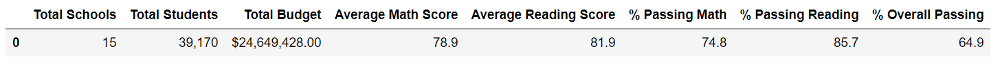
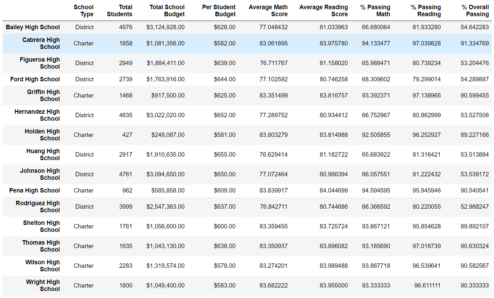
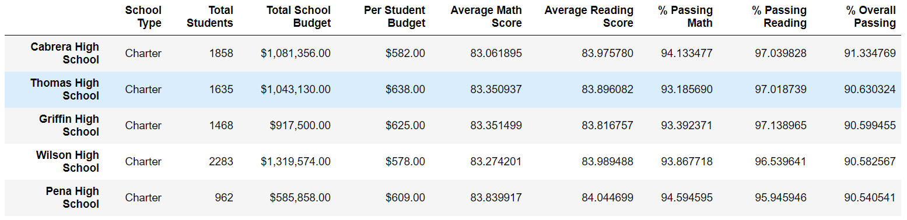
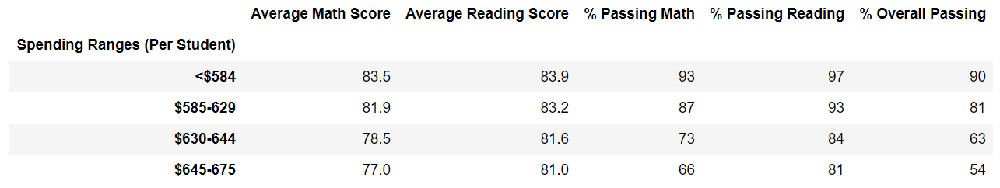
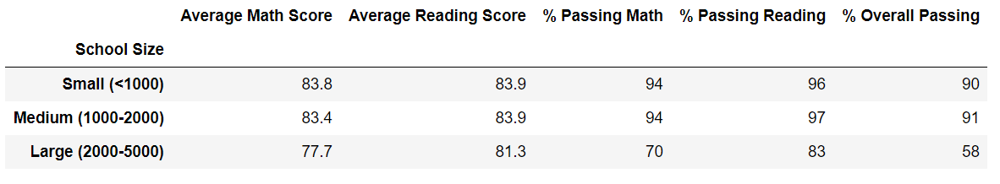
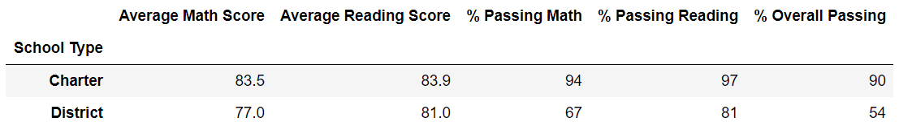

# School_District_Analysis

## Project Overview
A school district has given data on standardized testing scores to find performance trends and analysis.

1. Calculate the total number of schools and students.
2. Get a complete list of the students and testing scores.
3. Calculate the average and percentage of math and reading scores per school, school size, budget, and school type.

##Resources
- Data Source: schools_complete.csv, students_complete
- Softwar: Python 3.7.6, Visual Studio Code, 1.52.1

## Summary
The analysis of the school district show that:
- There were 15 schools in the district.
- The total number of students were 39,170.
- Scores:
    - Average math score: 78.9
    - Average reading score: 87.9
- Percent passing:
    - Math: 74.8%
    - Reading 85.7%
    - Overall 64.9%
- Total Budget: $24,649,428.00  

    
## Challenge Overview
The chanllenge was remove Thomas High School ninth grade test scores from the analysis due to academic dishonestry where the scores were altered.

## Challenge Summary
After inputting the ninth graders’ math and reading scores as null values, the rank of Thomas High School dropped to 65.08% overall passing from 90.95%. This would definitely skew the performance numbers in the analysis. Therefore, removing the ninth graders’ scores completely from the analysis move the overall ranking of Thomas High School back to 2nd with 90.63%. This would have similar to analyses to the previous data with only slight variations in numbers. A total of 461 ninth grade students of Thomas High School were not included in the analysis.  

   
## School District Summary
- The top 5 best performing schools all feel within the $585-629 spending per student range with the exception of one in the $630-644 range. Their size was also under 2,000 students with the expection of one school at 2283 students. However, all schools were that of a charter school type.  

- Looking at the spending table, the better scores and overall passing percentage went to the lower spending ranges.  

- School sizes show better passing percentages with the sizes under 2000 and would appear to have a bigger impact than that of spending per student. 

- Comparing the two school types, charter schools have a much higher passing percentage than that of district shools. District schools show very low number of students passing math tests.  

- When comparing the scores per grade level, the scores remain consistant throughout the grades within their respective schools. The differences in the scores are between the schools themselves.
